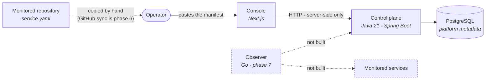
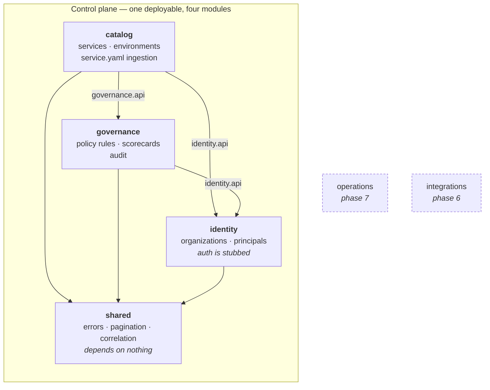
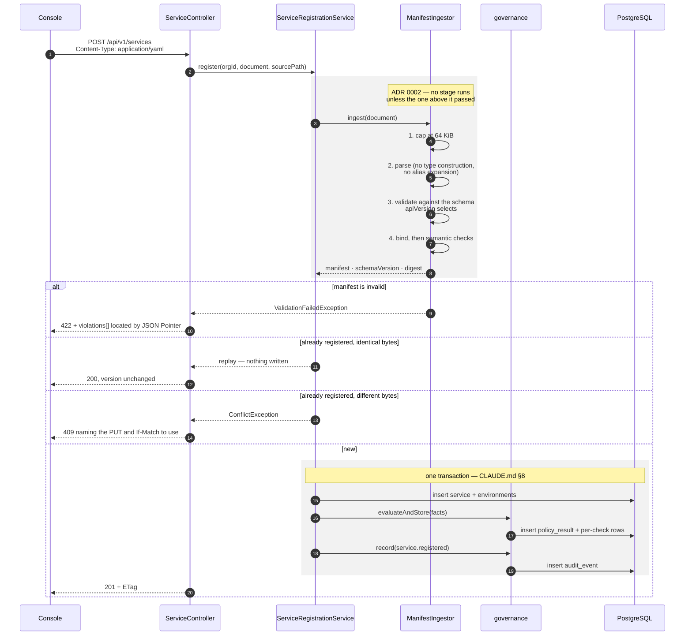
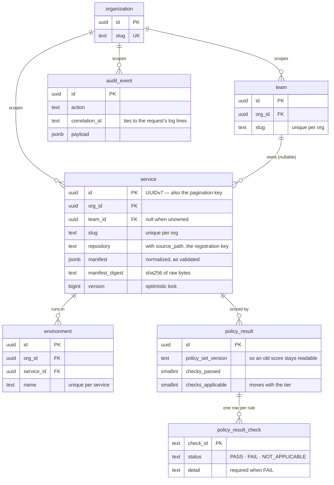

# Slice one architecture

What exists today, not the target. The target layout and the phases after this
one are in [`../roadmap.md`](../roadmap.md).

---

## Context

The dashed boxes are the reason nothing in this system reports health. The
observer is what would probe a service and publish an observation; it does not
exist, so every health field is null and the console says **never observed**
rather than showing a number nobody measured.

The console never talks to the control plane from the browser. Reads happen in
Server Components and the single write goes through a Next route handler, so the
control plane's address stays server-side and there is no CORS policy to get
wrong.

---

## Modules

Each module exposes an `api` package and hides an `internal` one. `ArchitectureTest`
fails the build when anything crosses that line, when `shared` reaches sideways,
when a persistence entity escapes its module, when governance reaches back into
catalog, or when a package appears for a phase that is not active. Those rules
are what make this a modular monolith rather than a monolith with some packages —
see [ADR 0001](../adr/0001-modular-monolith-as-one-gradle-module.md).

**The catalog → governance dependency runs one way.** Catalog calls governance
when it registers something; governance never calls back. If it did, the two
would be one module wearing two names.

---

## Registering a service

The sequence worth drawing, because it is where the transactional guarantee lives.

Steps 12–16 are one transaction. A service row, its first scorecard and its audit
entry all exist or none do — asserted by forcing a mid-registration failure and
checking that all three are absent.

---

## Data model

Three things in that diagram are load-bearing and easy to miss:

- **`service.team_id` is nullable.** An unowned service must be registerable,
  because the catalog's job includes showing that nobody is accountable for
  something.
- **`service` and `environment` reference their parent by `(org_id, id)`, not by
  `id` alone.** A single-column foreign key would let a scoping bug attach rows
  across the organization boundary while every individual constraint stayed
  satisfied. The composite version makes the database refuse it, and
  `OrgIsolationIT` proves it does.
- **`audit_event` has no foreign key to `service`.** An audit entry must outlive
  what it describes; a cascade would erase exactly the record worth keeping.

---

## What is not here

| Not present | Why | Phase |
|---|---|---|
| Health, SLO attainment, 30-day history | needs the observer to probe something | 7 |
| Dependency graph, blast radius | needs the observer and trace data | 7 |
| Authentication and authorization | stubbed by design — [ADR 0003](../adr/0003-org-scoping-stub.md) | later |
| Policy exceptions | need an approver, which needs identity | later |
| Reading `service.yaml` from GitHub | needs an App identity and permission model | 6 |
| Redis, Kafka, outbox | only once there is a demonstrated need (§6) | 9 |
| Terraform, Kubernetes, Helm | nothing to deploy until there is something to run | 10 |
