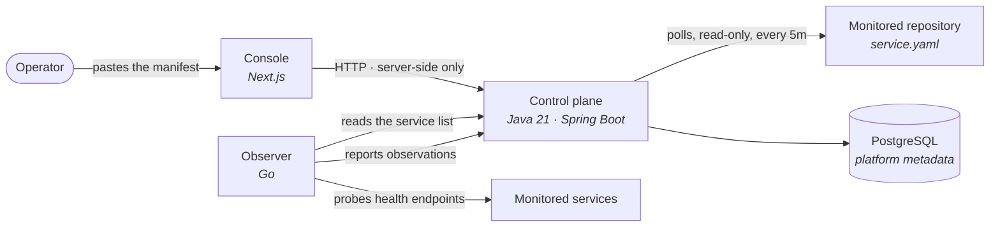
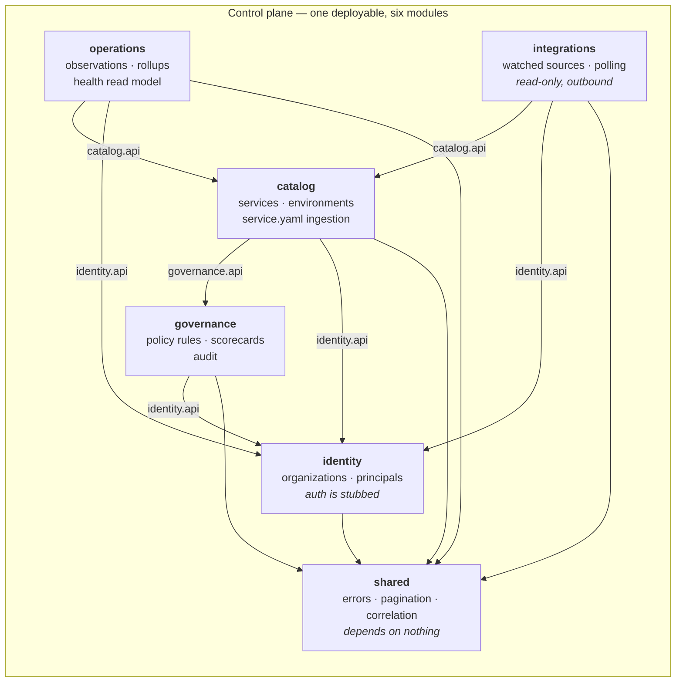
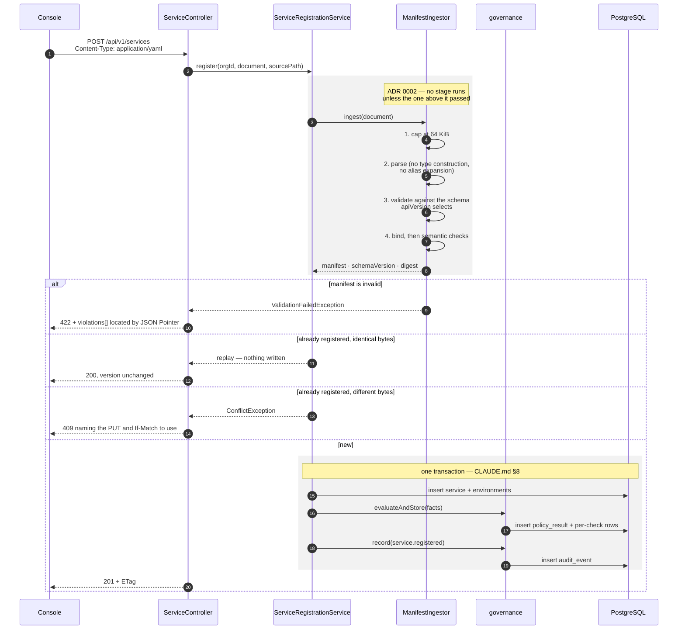
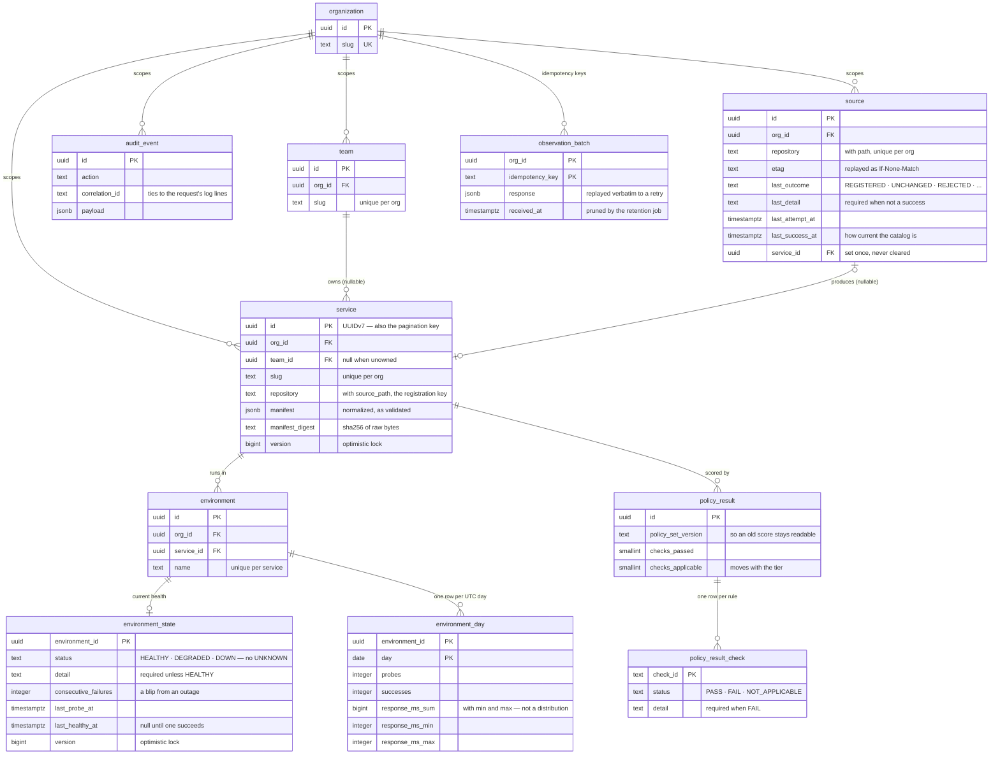
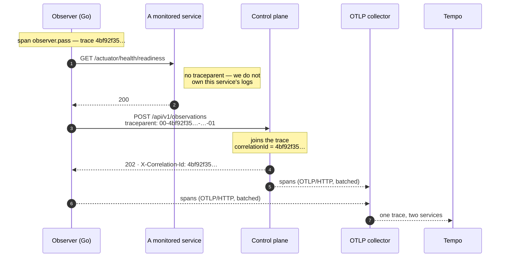

# Architecture — what exists today

Slice one plus phases 6, 7 and 8. Deliberately a description of what is built,
not of what is planned; the target layout and the remaining phases are in
[`../roadmap.md`](../roadmap.md).

---

## Context

The observer is the only thing here that measures anything. It reads the
catalog, probes what the manifests declare, and reports results back; the
control plane folds them into counters rather than storing a row per probe
(ADR 0009).

An environment the observer has not reached has **no health record at all**,
and the console renders that as an outline rather than a reading. Never
observed and observed-and-broken are different facts, and the absence of a row
is what keeps them apart.

A manifest reaches the catalog two ways, and both end in the same ingestion
path: an operator pastes it, or the control plane polls a watched repository for
it. The arrow to the repository points outward and only outward — OpsAtlas reads
and never writes, which is what ADR 0008 trades webhook latency for.

The console never talks to the control plane from the browser. Reads happen in
Server Components and the single write goes through a Next route handler, so the
control plane's address stays server-side and there is no CORS policy to get
wrong.

---

## Modules

Each module exposes an `api` package and hides an `internal` one. `ArchitectureTest`
fails the build when anything crosses that line, when `shared` reaches sideways,
when a persistence entity escapes its module, when governance reaches back into
catalog, or when a package appears for a phase that is not active. Those rules
are what make this a modular monolith rather than a monolith with some packages —
see [ADR 0001](../adr/0001-modular-monolith-as-one-gradle-module.md).

**The dependencies run one way: integrations → catalog → governance.** Catalog
calls governance when it registers something, and never calls back. Catalog also
does not know that `integrations` exists — it accepts a document from anywhere,
which is precisely why a polled manifest and a pasted one cannot be treated
differently. Both directions are enforced by `ArchitectureTest`, as is the rule
that **only `integrations` may make an outbound HTTP call at all** — that is ADR
0008's "OpsAtlas never writes to a repository" expressed as something the build
can check.

---

## Registering a service

The sequence worth drawing, because it is where the transactional guarantee lives.

Steps 12–16 are one transaction. A service row, its first scorecard and its audit
entry all exist or none do — asserted by forcing a mid-registration failure and
checking that all three are absent.

---

## Data model

Three things in that diagram are load-bearing and easy to miss:

- **`service.team_id` is nullable.** An unowned service must be registerable,
  because the catalog's job includes showing that nobody is accountable for
  something.
- **`service` and `environment` reference their parent by `(org_id, id)`, not by
  `id` alone.** A single-column foreign key would let a scoping bug attach rows
  across the organization boundary while every individual constraint stayed
  satisfied. The composite version makes the database refuse it, and
  `OrgIsolationIT` proves it does.
- **`audit_event` has no foreign key to `service`.** An audit entry must outlive
  what it describes; a cascade would erase exactly the record worth keeping.
- **`environment_state` has no probe counters and no `UNKNOWN` status.** Current
  state is a status, a reason and a failure streak; the counting happens in
  `environment_day`. An environment nobody has probed has **no row at all**, so
  absence means never-observed and cannot be confused with a measurement — which
  is why the status column has three values rather than four.
- **`environment_day` stores a sum, a min and a max — and that is the ceiling.**
  Storage is environments × retained days, independent of how often the observer
  probes (ADR 0009). The deliberate cost is that no percentile can ever be
  computed from it, which is why the API reports mean and max and calls them
  mean and max.
- **`observation_batch` stores the response, not just the key.** A retry replays
  the first attempt's answer verbatim; recomputing it could return something
  different once state has moved on, and a retry must not be able to observe
  that. Counters are exactly the shape where a double-write is silent.
- **`source` carries two timestamps, not one.** `last_attempt_at` and
  `last_success_at` together answer "how current is what I am looking at", which
  is the question a reader of a failing source actually has. Neither answers it
  alone, and `service_id` is set once and never cleared so a failing source can
  still say which service has gone stale.

---

## One request, end to end

The decision this draws is [ADR 0011](../adr/0011-correlation-id-is-the-trace-id.md):
**a request's correlation ID is its trace ID.** Without it, a log line says
`correlationId=8f2c…` while the trace covering the same work says `traceId=a41b…`,
and joining them means joining on timestamps — which is how a two-minute
investigation becomes twenty.

Four properties of that picture are the design, and each is asserted rather than
asserted-in-prose:

- **The observer's span and the control plane's are one trace.** `traceparent`
  goes out on the catalog and reporter clients, and the control plane joins it
  rather than starting a second trace — `TraceCorrelationIT`.
- **The probe carries nothing.** It reaches a system OpsAtlas does not own, and
  putting our identifiers in somebody else's headers and logs is not a decision a
  monitoring tool gets to make unilaterally. A Go test fails if a probe sends
  `traceparent`, and it was checked by mutation rather than trusted.
- **A caller's own `X-Correlation-Id` wins**, and is tagged on the span. §9 says
  the ID is accepted and echoed; a caller who sends one and gets a different one
  back cannot correlate anything.
- **Export is best-effort.** The collector being down is an ordinary condition
  and must cost a request nothing — `TraceCorrelationIT` points the exporter at a
  closed port and asserts the requests still succeed.

Metrics go the other way: nothing is pushed. Prometheus scrapes
`/actuator/prometheus` on the control plane and `:9090/metrics` on the observer,
so neither process needs to know who is collecting, and neither fails if nobody
is.

---

## What is not here

| Not present | Why | Phase |
|---|---|---|
| Real-user SLO measurement | probe availability is not an SLO; this needs real traffic, not a prober | later |
| Latency percentiles | span durations are in Tempo, but nothing aggregates them, and the rollups store mean and max by design (ADR 0009) | later |
| Log shipping (Loki) | stdout JSON already carries the correlation ID; an agent, a retention policy and a second query language is a lot to beat `docker logs \| grep` (ADR 0011) | later |
| Desired-versus-observed drift | needs a deployment concept to compare against | later |
| Dependency graph, blast radius | the traces exist now, but deriving a graph from them is its own feature | later |
| Authentication and authorization | stubbed by design — [ADR 0003](../adr/0003-org-scoping-stub.md) | later |
| Policy exceptions | need an approver, which needs identity | later |
| A GitHub App (higher rate limits, no personal credential) | needs a registered application, a private key and an installation flow | later |
| Redis, Kafka, outbox | only once there is a demonstrated need (§6) | 9 |
| Terraform, Kubernetes, Helm | nothing to deploy until there is something to run | 10 |
